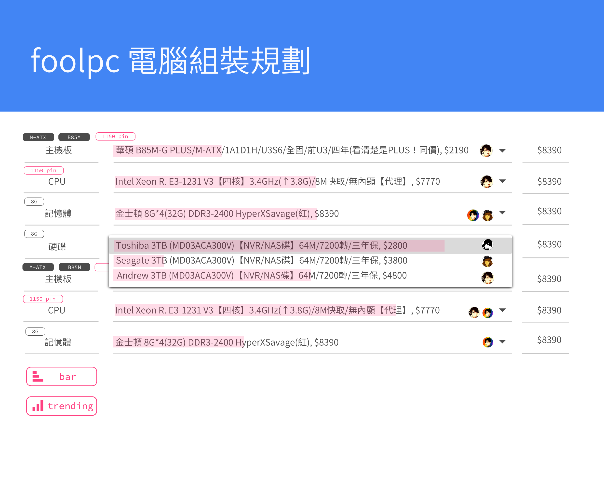

# foolpc



組裝電腦規劃書網站 2.0

大家應該都用過類似 coolpc 原價網提供的估價計畫單吧。

有幾個需求點改善：

1. 智慧過濾條件/相容過濾。例如：當我選取 cpu 後，應該把主版不符的腳位自動隱藏過濾掉。
2. 市場統計圖表參考。無論是流行的組合，還是流行單點項目應該要數據化/量化、圖表化/視覺化。所以，當我選取 cpu 後，可顯示這個項目有幾啪的人購買。
3. 智慧選擇。當我選取 cpu 後，其他項目自動選取多數人的組合。例如：當我選取了 cpu intel e3-1231 v3 後，自動選取主版為 B85-D3H 。
4. 黑名單條件：可先指定底線：預算、MB M-ATX、CPU intel 、VGA ATI (已經有了，只是畫面配置、圖示要調整)
5. 圖片化，選取項目同時，需要產品圖片。目前的作法仍只停留在提示窗模式。
6. 美化、淨化
7. 差異分析。當過濾剩下少部份時，可結合規格差異。
8. Benchmark 。結合各大 benchmark 即時提供數據, cpu, hd, vga (目前外部網頁，需要結合不換頁觀看，而且還沒有連動。)
9. 評鑑。結合各大新聞、部落格文章，點選相關介紹
10. 自動計算需要瓦數 (已經有了)

## 資料來源

## 實做要點

將資料來源塞進類似於可 query (DSL, querable) 的資料結構。

針對過濾條件能力來思考。「相容過濾」、「智慧過濾」、「黑名單條件」基本上都屬於過濾功能。通盤考量之下，我們把可以把一筆資料賦予許多 tag，且具有相依條件的 tag 來達成。

objects:

```
asus mb b85m g-plus 1150 [mb, asus, mb/1150] [== cpu/1150]
intel cpu 1150 e3-1231 v3 [cpu, cpu/1150, intel] [== mb/1150]
```

queries:

* 主機版分類 query `mb` 就可以呈現出主機版的下拉選單了。另外在分類旁邊顯示可選取的 tag 來做過濾條件
* cpu 分類就下 query `cpu`

如果點選了 "intel cpu cpu-1150 e3-1231 v3" 項目，因為這個項目有寫相依 `cpu/1150` 所以幫 cpu 分類多點選一個 `cpu/1150` 過濾條件即可。

這邊你也可以看到有些條件本身相依其他條件 `1150` 不是獨立存在，是相依在 `cpu/1150` 或者 `mb/1150` ，也就是如果你選取了 `mb` 條件就不會顯示出 `cpu/1150` 以及 `cpu/*` 項目了。區域條件/全域條件, 相依條件/相容條件。

不過有些 tag 需要資料型別才能夠做 range ，這有點小麻煩。

### 標籤生成

* 自訂標籤
* 關鍵字

例如：主版 asus mb b85m g-plus 項目內文沒寫到 1150 腳位，所以要幫它新增 1150 腳位

關鍵字：如 intel, asus 內文有寫

關鍵字性質很容易讓使用者理解，所以方便 UGS 自行新增，而且是針對分類新增即可。自訂標籤只能單筆單筆維護。
