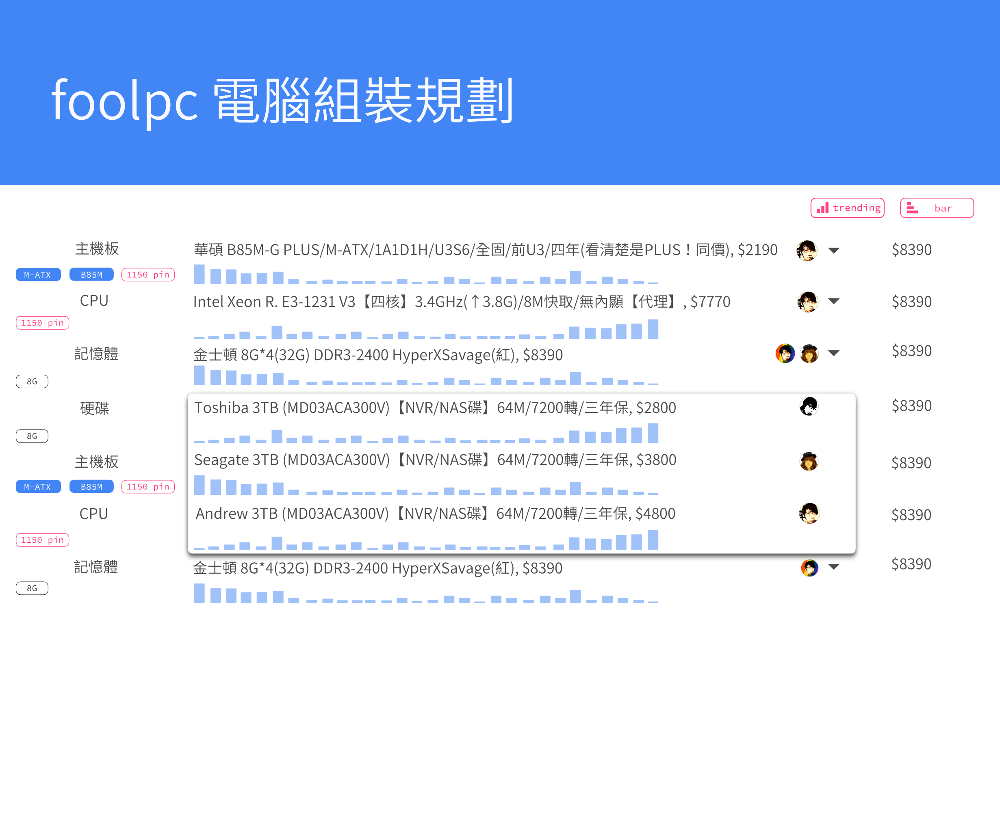

# foolpc

組裝電腦規劃書網站 2.0

大家應該都用過類似 coolpc 原價網提供的估價計畫單吧。

有幾個需求點改善：

1. 智慧過濾條件/相容過濾。例如：當我選取 cpu 後，應該把主版不符的腳位自動隱藏過濾掉。
2. 市場統計圖表參考。無論是流行的組合，還是流行單點項目應該要數據化/量化、圖表化/視覺化。所以，當我選取 cpu 後，可顯示這個項目有幾啪的人購買。
3. 智慧選擇。當我選取 cpu 後，其他項目自動選取多數人的組合。例如：當我選取了 cpu intel e3-1231 v3 後，自動選取主版為 B85-D3H 。
4. 黑名單條件：可先指定底線：預算、MB M-ATX、CPU intel 、VGA ATI (已經有了，只是畫面配置、圖示要調整)
5. 圖片化，選取項目同時，需要產品圖片。目前的作法仍只停留在提示窗模式。
6. 美化、淨化
7. 差異分析。B85M NA/PLUS 差哪裡？
8. Benchmark 。結合各大 benchmark 即時提供數據, cpu, hd, vga (目前外部網頁，需要結合不換頁觀看，而且還沒有連動。)
9. 評鑑。結合各大新聞、部落格文章，點選相關介紹
10. 自動計算需要瓦數 (已經有了)

## 元件資料來源
